<div style="text-align: center;">
    
</div>

# 1. Business Understanding

## 1.1 Problem Statement

Child mortality remains a major public health concern in the East African Community (EAC), where disparities in healthcare access and socioeconomic factors contribute to varying outcomes across countries. This analysis aims to explore spatial and temporal patterns of under-five and neonatal mortality rates within the EAC region. By leveraging geospatial data and time-series visualizations, the project seeks to identify countries with the highest burden of child mortality and uncover regional trends, supporting evidence-based interventions and policymaking.

## 1.2 Objectives

1. Filter data for the eight countries belonging to the East African Community (list here: https://www.eac.int/overview-of-eac)
2. Visualize the latest estimate of each indicator at the country level using shapefiles, which can be downloaded from www.gadm.org.
3. Show the average trends in the mortality rates over time (plot the average trend line and add the points in the graphic for the country level estimates for each indicator. Expectation: two plots).
4. Based on your visualizations, identify the countries with the highest under-five mortality rates in East Africa and the highest neonatal mortality.

# 2. Importing Libraries and Warnings

```{r setup, include=FALSE}
library(reticulate)
use_condaenv("r_env", required = TRUE)
```

```{r}
reticulate::py_install(
  packages = c("pandas", "seaborn", "geopandas", "matplotlib"),
  envname = NULL, # NULL means "use the current one"
  method = "auto",
  pip = TRUE
)
```


```{python}
import json
import warnings
import pandas as pd
import seaborn as sns
import geopandas as gpd
import matplotlib.pyplot as plt
warnings.filterwarnings("ignore")
```

# 3. Data Understanding


```{python}
# loading the data
burundi = gpd.read_file("data/gadm41_BDI_0.json")

# View and inspect
print(burundi.head())
print(burundi.crs) 

# Plot and save
ax = burundi.plot(figsize=(8, 6))
fig = ax.get_figure()
fig.savefig("burundi_map.png", dpi=300)
```
```{r}
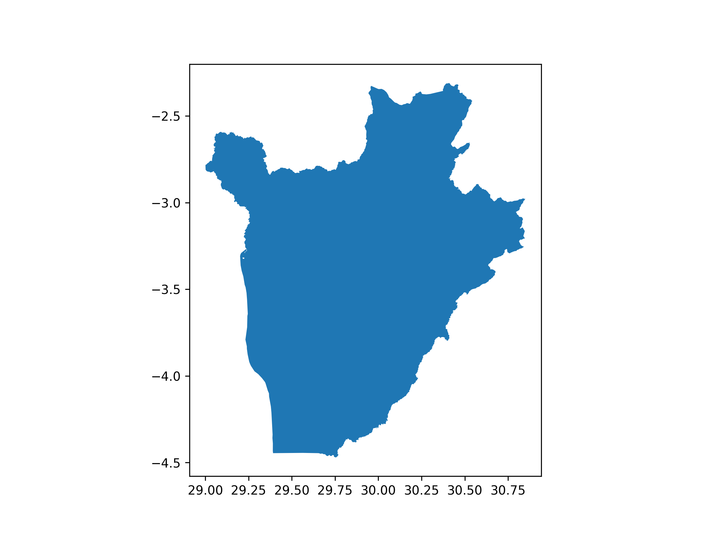
```

```{python}
# loading the data
congo = gpd.read_file("data/gadm41_COD_0.json")

# View and inspect
print(congo.head())
print(congo.crs) 

# Plot and save
ax = congo.plot(figsize=(8, 6))
fig = ax.get_figure()
fig.savefig("congo_map.png", dpi=300)
```

```{r}
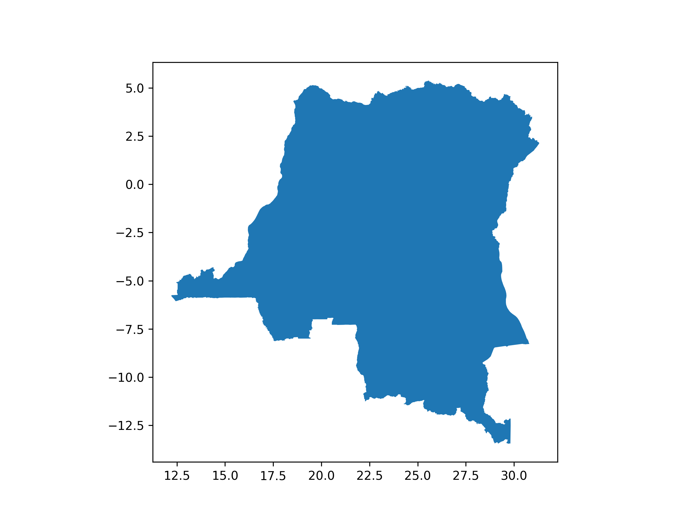
```

```{python}
# loading the data
kenya = gpd.read_file("data/gadm41_KEN_0.json")

# View and inspect
print(kenya.head())
print(kenya.crs) 

# Plot and save
ax = kenya.plot(figsize=(8, 6))
fig = ax.get_figure()
fig.savefig("kenya_map.png", dpi=300)
```

```{r}
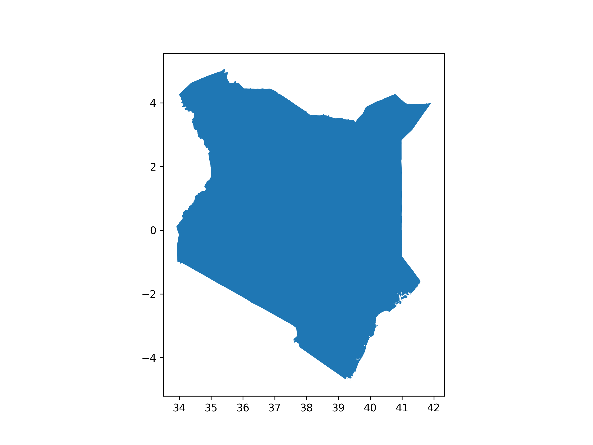
```

```{python}
# loading the data
rwanda = gpd.read_file("data/gadm41_RWA_0.json")

# View and inspect
print(rwanda.head())
print(rwanda.crs) 

# Plot and save
ax = rwanda.plot(figsize=(8, 6))
fig = ax.get_figure()
fig.savefig("rwanda_map.png", dpi=300)
```

```{r}
knitr::include_graphics("rwanda_map.png")
```

```{python}
# loading the data
somalia = gpd.read_file("data/gadm41_SOM_0.json")

# View and inspect
print(somalia.head())
print(somalia.crs) 

# Plot and save
ax = somalia.plot(figsize=(8, 6))
fig = ax.get_figure()
fig.savefig("somalia_map.png", dpi=300)
```

```{r}
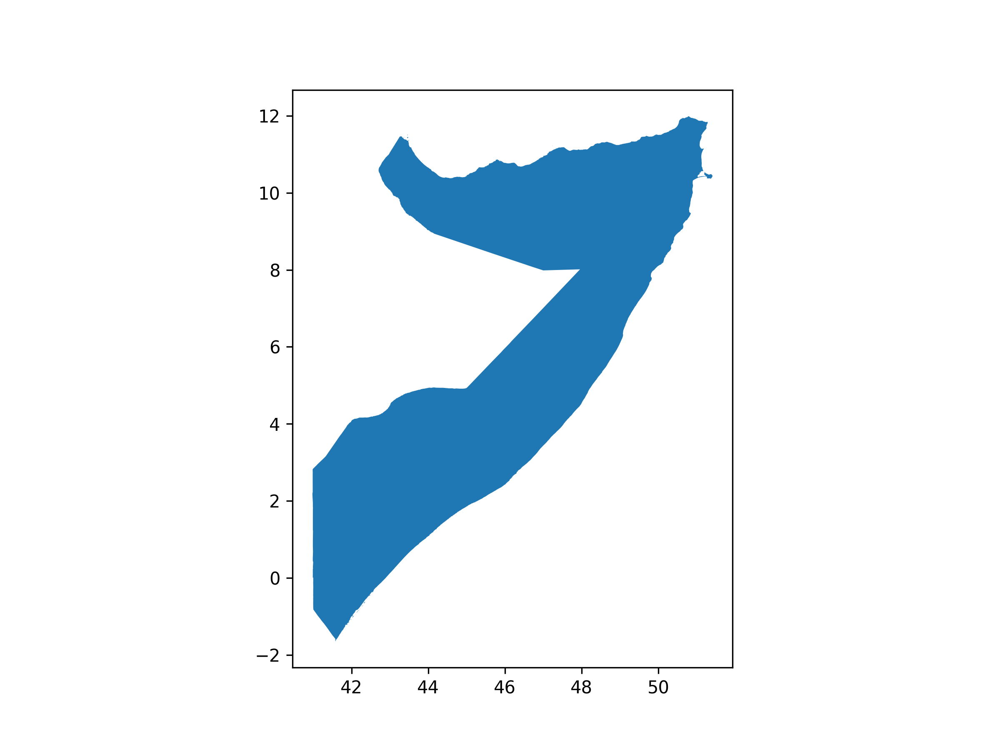
```

```{python}
# loading the data
sudan = gpd.read_file("data/gadm41_SSD_0.json")

# View and inspect
print(sudan.head())
print(sudan.crs) 

# Plot and save
ax = sudan.plot(figsize=(8, 6))
fig = ax.get_figure()
fig.savefig("sudan_map.png", dpi=300)
```

```{r}
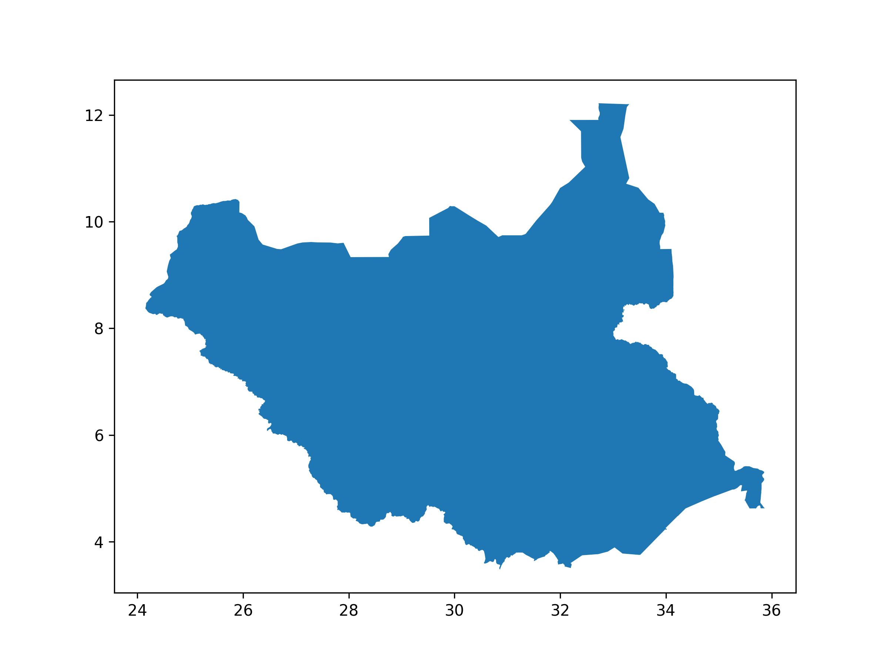
```

```{python}
# loading the data
tanzania = gpd.read_file("data/gadm41_TZA_0.json")

# View and inspect
print(tanzania.head())
print(tanzania.crs) 
tanzania.plot()     

# loading the data
tanzania = gpd.read_file("data/gadm41_TZA_0.json")

# View and inspect
print(tanzania.head())
print(tanzania.crs) 

# Plot and save
ax = tanzania.plot(figsize=(8, 6))
fig = ax.get_figure()
fig.savefig("tanzania_map.png", dpi=300)
```

```{r}
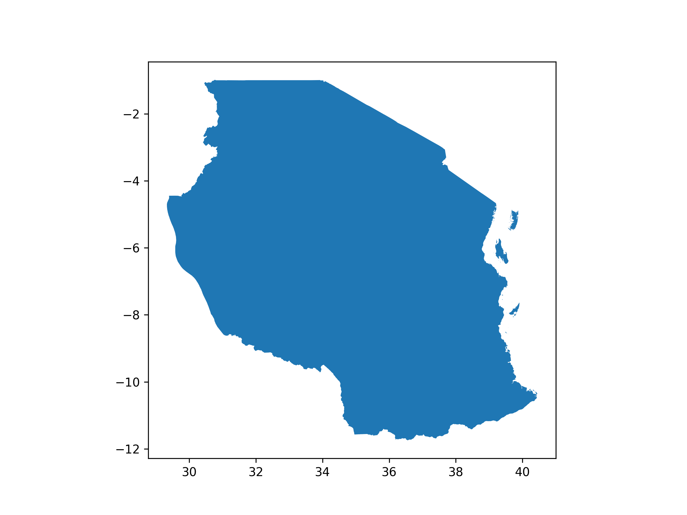
```

```{python}
# loading the data
uganda = gpd.read_file("data/gadm41_UGA_0.json")

# View and inspect
print(uganda.head())
print(uganda.crs) 

# Plot and save
ax = uganda.plot(figsize=(8, 6))
fig = ax.get_figure()
fig.savefig("uganda_map.png", dpi=300)
```

```{r}
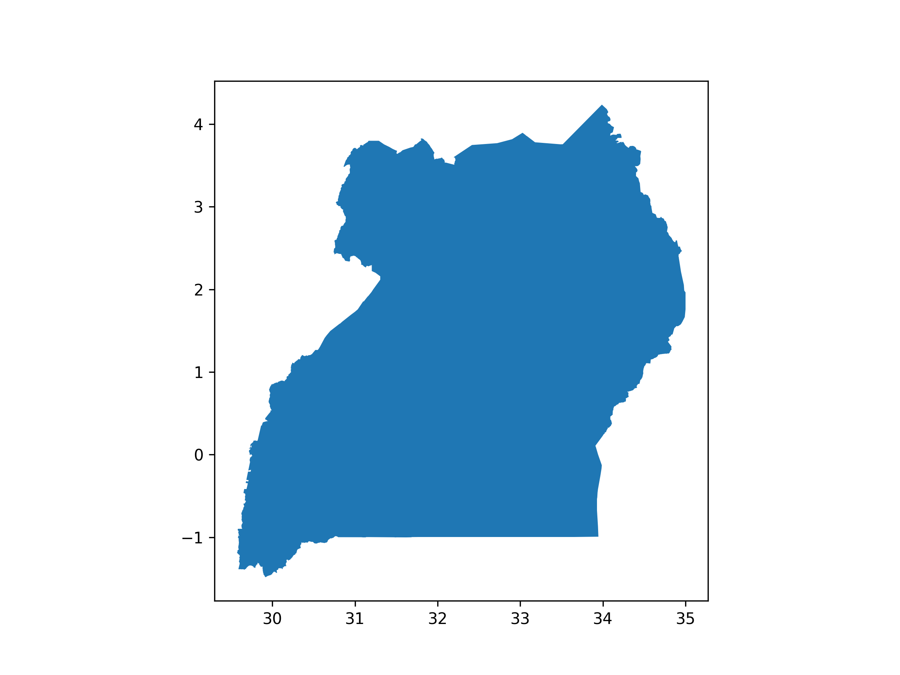
```

## Merging the 8 countries into a dataframe called east_africa

```{python}
# Merge them
east_africa = gpd.GeoDataFrame(pd.concat([
    burundi, congo, kenya, rwanda, somalia, sudan, tanzania, uganda
], ignore_index=True))

# displaying the result
print(east_africa.head())
east_africa.plot()
```

```{python}
east_africa.columns
```

```{python}
under_five = pd.read_excel("data/Under-five_Mortality_Rates_2024.xlsx", skiprows=14)
under_five
```

```{python}
under_five.columns
```

```{python}
under_five.describe()
```

```{python}
neonatal = pd.read_excel("data/Neonatal_Mortality_Rates_2024.xlsx", skiprows=14)
neonatal.head()
```

```{python}
neonatal.columns
```

```{python}
neonatal.describe()
```

# 4. Data Cleaning

## Dropping unwanted columns

```{python}
# Filter for median values only
under_five = under_five[
    (under_five['Uncertainty.Bounds*'] == 'Median')
][['ISO.Code', 'Country.Name', 'Uncertainty.Bounds*', '2010.5', '2011.5', '2012.5', '2013.5', '2014.5', '2015.5', '2016.5', '2017.5', '2018.5', '2019.5', '2020.5', '2021.5', '2022.5', '2023.5']]

under_five
```

```{python}
neonatal = neonatal[
    (neonatal['Uncertainty.Bounds*'] == 'Median')
][['ISO.Code', 'Country.Name', 'Uncertainty.Bounds*', '2010.5', '2011.5', '2012.5', '2013.5', '2014.5', '2015.5', '2016.5', '2017.5', '2018.5', '2019.5', '2020.5', '2021.5', '2022.5', '2023.5']]

neonatal
```

## Renaming columns

```{python}
east_africa = east_africa.rename(columns={
    'GID_0': 'code',
    'COUNTRY': 'country',
})

east_africa
```

```{python}
under_five = under_five.rename(columns={
    'ISO.Code': 'code',
    'Country.Name': 'country',
    'Uncertainty.Bounds*': 'estimate_type',
    '2010.5': '2010',
    '2011.5': '2011',
    '2012.5': '2012',
    '2013.5': '2013',
    '2014.5': '2014',
    '2015.5': '2015',
    '2016.5': '2016',
    '2017.5': '2017',
    '2018.5': '2018',
    '2019.5': '2019',
    '2020.5': '2020',
    '2021.5': '2021',
    '2022.5': '2022',
    '2023.5': '2023'
})

under_five
```

```{python}
neonatal = neonatal.rename(columns={
    'ISO.Code': 'code',
    'Country.Name': 'country',
    'Uncertainty.Bounds*': 'estimate_type',
        '2010.5': '2010',
    '2011.5': '2011',
    '2012.5': '2012',
    '2013.5': '2013',
    '2014.5': '2014',
    '2015.5': '2015',
    '2016.5': '2016',
    '2017.5': '2017',
    '2018.5': '2018',
    '2019.5': '2019',
    '2020.5': '2020',
    '2021.5': '2021',
    '2022.5': '2022',
    '2023.5': '2023'
})

neonatal
```

## Duplicates

```{python}
east_africa.duplicated().sum()
```

```{python}
under_five.duplicated().sum()
```

```{python}
neonatal.duplicated().sum()
```

## Missing Values

```{python}
east_africa.isna().sum()
```

```{python}
under_five.isna().sum()
```

```{python}
neonatal.isna().sum()
```

```{python}
# List of East African countries codes
eac_codes = ['BDI', 'COD', 'KEN', 'RWA', 'SOM', 'SSD', 'TZA', 'UGA']

# Filter under_five
under_five_eac = under_five[under_five['code'].isin(eac_codes)]
under_five_eac
```

```{python}
# Filter neonatal
neonatal_eac = neonatal[neonatal['code'].isin(eac_codes)]
neonatal_eac
```

```{python}
# Merge under-five mortality rates into east_africa shapefile
east_africa_under_five = east_africa.merge(under_five_eac, on='code')
east_africa_under_five
```

```{python}
# drop extra columns
east_africa_under_five.drop(columns = ['country_y'], axis = 1, inplace = True)

# rename country_x to country
east_africa_under_five.rename(columns={
    'country_x': 'country'
}, inplace = True)

east_africa_under_five
```

```{python}
# Merge neonatal mortality rates into east_africa shapefile
east_africa_neonatal = east_africa.merge(neonatal_eac, on='code')
east_africa_neonatal
```

```{python}
# drop extra columns
east_africa_neonatal.drop(columns = ['country_y'], axis = 1, inplace = True)

# rename country_x to country
east_africa_neonatal.rename(columns={
    'country_x': 'country'
}, inplace = True)

east_africa_neonatal
```

# 5. EDA

## Visualize the latest estimate of each indicator at the country level using shapefiles

```{python}
# Plot under-five mortality and save to a file
fig, ax = plt.subplots(1, 1, figsize=(10, 8))
east_africa_under_five.plot(column='2023', cmap='Reds', legend=True, ax=ax)
ax.set_title('Under-Five Mortality Rate in East Africa (2023)', fontsize=15)
plt.axis('off')

# Save the figure
plt.savefig('under_five_mortality_2023.png', dpi=300, bbox_inches='tight')
```
```{r}
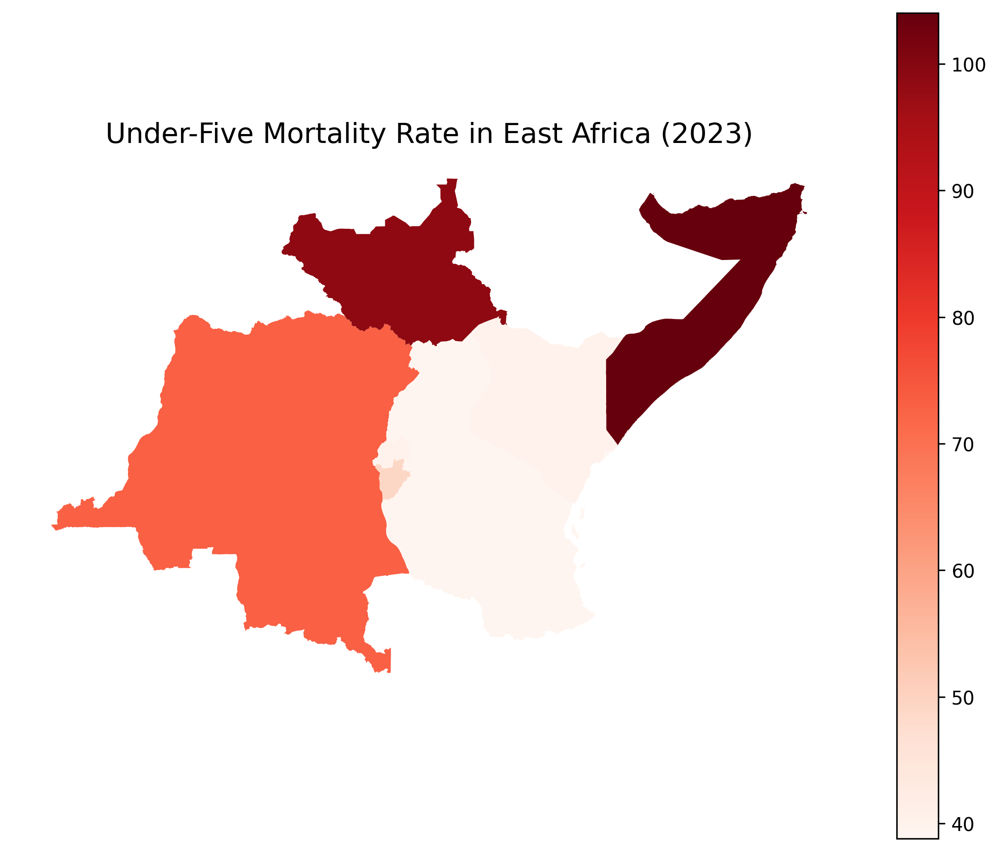
```

### Interpretation

South Sudan and Somalia consistently have the highest under-five mortality rates (above 100 deaths per 1000 live births for much of the period).

Kenya, Rwanda, Tanzania, and Uganda show much lower rates — below 70 deaths/1000 births, and they keep decreasing over time.

The average mortality rate across East Africa shows a steady decline over the years.

Some countries (like Somalia and South Sudan) have a lot more fluctuations, while others (like Rwanda and Kenya) show a smoother decline.

```{python}
# Plot neonatal mortality
fig, ax = plt.subplots(1, 1, figsize=(10, 8))
east_africa_neonatal.plot(column='2023', cmap='Blues', legend=True, ax=ax)
ax.set_title('Neonatal Mortality Rate in East Africa (2023)', fontsize=15)
plt.axis('off')

# Save the figure
plt.savefig('neonatal_mortality_2023.png', dpi=300, bbox_inches='tight')
```
```{r}
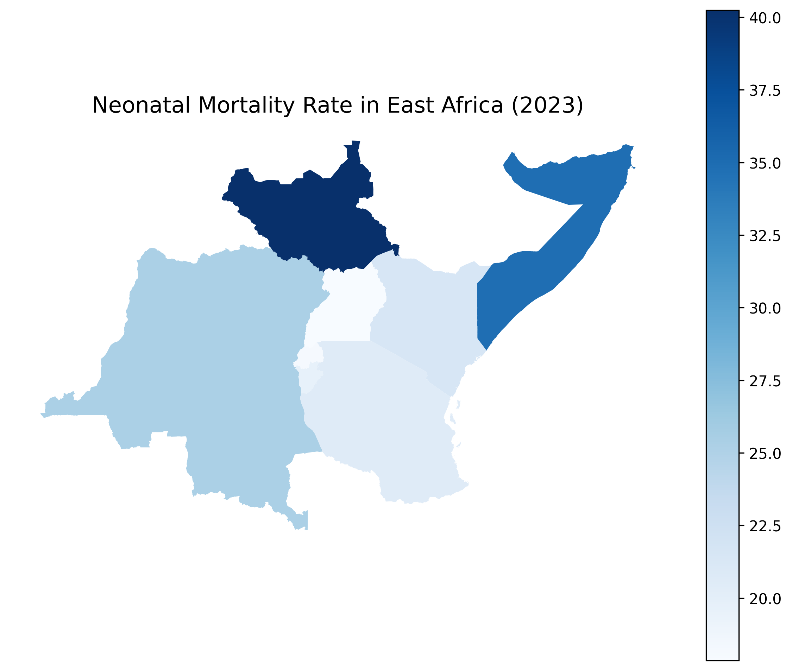
```

### Interpretation

The rates are lower than under-five mortality overall (as expected), but similar country patterns.

South Sudan and Somalia again show the highest neonatal mortality rates (around 40–45 deaths per 1000 births).

Kenya, Rwanda, and Tanzania again have much better outcomes (around 20–25 deaths per 1000).

The average neonatal mortality across the region is steadily declining, although the decline is slower compared to the under-five mortality rate.

## Show the average trends in the mortality rates over time (plot the average trend line and add the points in the graphic for the country level estimates for each indicator. Expectation: two plots). 

```{python}
# 2. Melt/reshape the data
under_five_melted = east_africa_under_five.melt(id_vars=['code', 'country'], 
                                       value_vars=[str(year) for year in range(2010, 2024)],
                                       var_name='year', 
                                       value_name='under_five_rate')

# Convert year to integer
under_five_melted['year'] = under_five_melted['year'].astype(int)

# 3. Plotting
plt.figure(figsize=(14,6))

# Under-five mortality plot
plt.subplot(1, 2, 1)
sns.lineplot(
    data=under_five_melted,
    x='year',
    y='under_five_rate',
    ci=None,
    label='Average',
    estimator='mean'
)

# Remove legend=False here
sns.scatterplot(
    data=under_five_melted,
    x='year',
    y='under_five_rate',
    hue='country',   # Keep coloring by country
    s=40
)

plt.title('Under-Five Mortality Rate (East Africa)')
plt.ylabel('Mortality Rate (per 1000 live births)')
plt.xlabel('Year')
plt.legend(title='Country', bbox_to_anchor=(1.05, 1), loc='upper left')
plt.tight_layout()

# Save the plot as a PNG image
plt.savefig('under_five_mortality_rate_east_africa.png', dpi=300, bbox_inches='tight')
```
```{r}
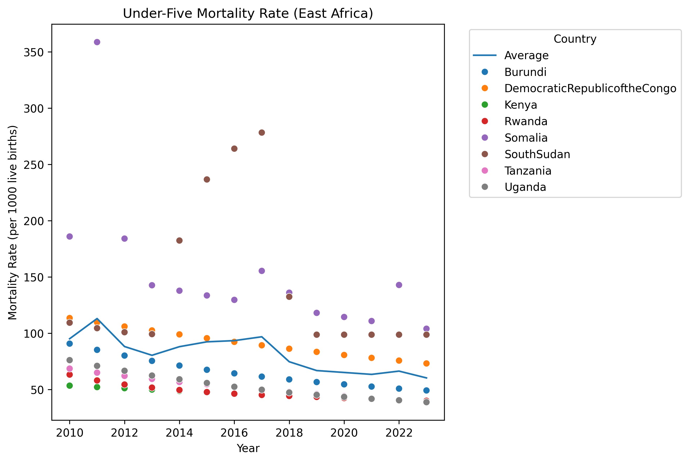
```

### Interpretation

South Sudan and Somalia are deep red, meaning very high under-five mortality (>100 deaths/1000).

Kenya, Tanzania, and Rwanda are much lighter, indicating lower under-five mortality (closer to 40-50 deaths/1000).

```{python}
# 2. Melt/reshape the data
neonatal_melted = east_africa_neonatal.melt(id_vars=['code', 'country'], 
                                   value_vars=[str(year) for year in range(2010, 2024)],
                                   var_name='year', 
                                   value_name='neonatal_rate')

# Convert year to integer
neonatal_melted['year'] = neonatal_melted['year'].astype(int)

# 3. Plotting
plt.figure(figsize=(14,6))

# Neonatal mortality plot
plt.subplot(1, 2, 2)
sns.lineplot(
    data=neonatal_melted,
    x='year',
    y='neonatal_rate',
    ci=None,
    label='Average',
    estimator='mean'
)
sns.scatterplot(
    data=neonatal_melted,
    x='year',
    y='neonatal_rate',
    hue='country',
    s=40
)
plt.title('Neonatal Mortality Rate (East Africa)')
plt.ylabel('Mortality Rate (per 1000 live births)')
plt.xlabel('Year')
plt.legend(title='Country', bbox_to_anchor=(1.05, 1), loc='upper left')
plt.tight_layout()

# Save the plot as a PNG image
plt.savefig('neonatal_mortality_rate_east_africa.png', dpi=300, bbox_inches='tight')
```
```{r}
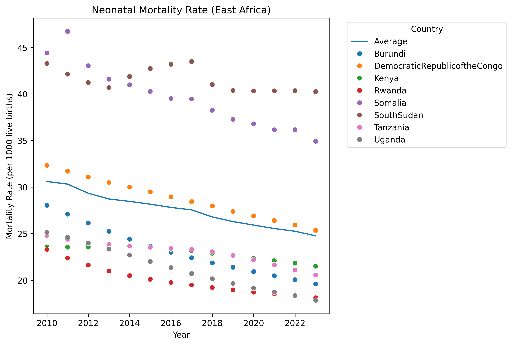
```
### Interpretation

Again, South Sudan and Somalia are the darkest, meaning they have the highest neonatal deaths (>37 deaths/1000).

Kenya, Rwanda, and Tanzania show the lowest neonatal mortality, shaded much lighter.

Most other countries fall somewhere in between.

## Based on your visualizations, identify the countries with the highest under-five mortality rates in East Africa and the highest neonatal mortality. 

```{python}
# Highest under-five mortality
highest_under_five = under_five_eac.sort_values(by='2023', ascending=False).head(1)

# Highest neonatal mortality
highest_neonatal = neonatal_eac.sort_values(by='2023', ascending=False).head(1)

print("Highest Under-Five Mortality:", highest_under_five[['country', '2023']])
print("Highest Neonatal Mortality:", highest_neonatal[['country', '2023']])
```

### Interpretation

In 2023, Somalia recorded the highest under-five mortality rate in East Africa, with approximately 104 deaths per 1,000 live births, indicating a severe challenge in child survival beyond the neonatal stage. Meanwhile, South Sudan had the highest neonatal mortality rate, with about 40 deaths per 1,000 live births, reflecting major issues in newborn health and care within the first month of life. These figures suggest that both countries are facing critical health system weaknesses, likely exacerbated by ongoing conflict, instability, and limited access to quality maternal and child healthcare services.

## Write a paragraph on your findings.

Between 2010 and 2023, East Africa experienced a steady decline in both under-five and neonatal mortality rates, reflecting significant improvements in child health outcomes across the region. Countries like Rwanda, Kenya, Tanzania, and Uganda achieved the most notable progress, consistently recording lower mortality rates compared to regional averages. In contrast, South Sudan and Somalia continued to report the highest rates, with under-five mortality often exceeding 100 deaths per 1,000 live births and neonatal mortality remaining above 40 deaths per 1,000 live births. The regional averages show a positive downward trend, although the pace of improvement varied across countries. By 2023, the spatial distribution maps clearly highlighted persistent disparities, with countries experiencing political instability and conflict showing the greatest challenges in reducing child mortality, while more stable nations demonstrated remarkable success in improving early childhood survival.

