<div style="text-align: center;">
    
</div>

# 1. Business Understanding

## 1.1 Problem Statement

HIV continues to be a major public health issue in Africa, with a high number of people living with the virus, especially in sub-Saharan regions. While prevention and treatment efforts have improved, HIV is a lifelong condition, making it crucial to track data on this affected. This data helps us identify infection trends, prepare healthcare services to accommodate these patients, and address challenges like stigma and inequality. Beyond health, HIV also impacts jobs, healthcare costs, and poverty levels, making it important to use data to create targeted interventions. By analyzing this information, governments and organizations can better allocate resources and create policies to help reduce transmission and improve the quality of life for those affected.

## 1.2 Objectives

Create a visualization that shows the trend of HIV cases in the countries that contribute to 75% of the global burden </br>
</br>
Generate a visualization that displays the trend of HIV cases in the countries contributing to 75% of the burden within each WHO region (column called ParentLocationCode contains the WHO regions)

# 2. Importing Libraries and Warnings

```{r setup, include=FALSE}
library(reticulate)
use_condaenv("r_env", required = TRUE)
```


```{python}
import warnings
import numpy as np
import pandas as pd
import seaborn as sns
import statsmodels.api as sm
import matplotlib.pyplot as plt
warnings.filterwarnings("ignore")
from statsmodels.regression.mixed_linear_model import MixedLM
```

# 3. Data Understanding

You are provided with a dataset from the World Health Organization (WHO) Global Observatory, containing data on people living with HIV at the country level from 2000 to 2023.

```{python}
hiv_data = pd.read_csv("data/HIV data 2000-2023.csv", encoding="latin1")
hiv_data
```

You have also been provided with World Bank data on the multidimensional poverty headcount ratio, which includes factors such as income, educational attainment, school enrolment, electricity access, sanitation and drinking water.

```{python}
poverty_data = pd.read_excel("data/multidimensional_poverty.xlsx")
poverty_data
```

We would like you to merge this dataset with the HIV data above and analyze the relationship between people living with HIV and multidimensional poverty, and the individual factors that contribute to the ratio. Remember to account for the random effects (country, year).

```{python}
hiv_data.columns
```

```{python}
poverty_data.columns
```

```{python}
hiv_data.info()
```

```{python}
poverty_data.info()
```

```{python}
hiv_data.describe()
```

```{python}
poverty_data.describe()
```

```{python}
hiv_data.shape
```

```{python}
poverty_data.shape
```

# 4. Data Cleaning

## Renaming columns

```{python}
hiv_data.rename(columns={
    'Location': 'Country',
    'Period': 'Year',
    'Value': 'HIV_Population'
}, inplace=True)

hiv_data.columns
```

```{python}
# Rename columns for ease of use
poverty_data.columns = [
    'Region', 'Country_Code', 'Country', 'Year', 'Survey_Name',
    'Survey_Year', 'Survey_Coverage', 'Welfare_Type', 'Survey_Comparability',
    'Monetary', 'Education_Attainment', 'Education_Enrollment',
    'Electricity', 'Sanitation', 'Drinking_Water', 'Multidimensional_Poverty'
]

# Drop the first and second rows
poverty_data = poverty_data.drop(index=[0, 1]).reset_index(drop=True)
poverty_data
```

## Keeping only the relevant columns

```{python}
hiv_data = hiv_data[['Country', 'Year', 'HIV_Population', 'ParentLocationCode']]
hiv_data
```

```{python}
poverty_data = poverty_data[[
    'Country',
    'Country_Code',
    'Year',
    'Monetary',
    'Education_Attainment',
    'Education_Enrollment',
    'Electricity',
    'Sanitation',
    'Drinking_Water',
    'Multidimensional_Poverty'
]]

poverty_data
```

## Duplicates

```{python}
hiv_data.duplicated().sum()
```

```{python}
poverty_data.duplicated().sum()
```

## Missing Values

```{python}
poverty_data.isna().sum()
```

```{python}
poverty_data
```

```{python}
# Replace '-' strings with actual NaN values
poverty_data.replace('-', pd.NA, inplace=True)
poverty_data
```

```{python}
# Columns to convert
numeric_columns = [
    'Monetary', 'Education_Attainment', 'Education_Enrollment',
    'Electricity', 'Sanitation', 'Drinking_Water', 'Multidimensional_Poverty'
]

# Convert to numeric
poverty_data[numeric_columns] = poverty_data[numeric_columns].apply(pd.to_numeric, errors='coerce')
poverty_data
```

```{python}
poverty_data[numeric_columns] = poverty_data[numeric_columns].fillna(poverty_data[numeric_columns].mean())
poverty_data
```

```{python}
hiv_data.isna().sum()
```

```{python}
hiv_data
```

There are rows in the HIV_Population column called No data

```{python}
hiv_data[hiv_data['HIV_Population'] == 'No data'].shape[0]
```

```{python}
hiv_data[hiv_data['HIV_Population'] == 'No data']
```

```{python}
# dropping the missing values
hiv_data = hiv_data[hiv_data['HIV_Population'] != 'No data']
hiv_data
```

```{python}
# Removing range values 
hiv_data = hiv_data[hiv_data['HIV_Population'] != 'No data'].copy()
hiv_data['HIV_Population'] = hiv_data['HIV_Population'].str.extract(r'(\d[\d\s]*)')[0]
hiv_data['HIV_Population'] = hiv_data['HIV_Population'].str.replace(' ', '').astype(int)

hiv_data
```

# 5. EDA

Create a visualization that shows the trend of HIV cases in the countries that contribute to 75% of the global burden

```{python}
# Total HIV per country
total_by_country = hiv_data.groupby('Country')['HIV_Population'].sum().reset_index()

# Calculate cumulative % contribution
total_by_country = total_by_country.sort_values(by='HIV_Population', ascending=False)
total = total_by_country['HIV_Population'].sum()
total_by_country['CumulativePercent'] = 100 * total_by_country['HIV_Population'].cumsum() / total

# Filter countries that contribute to 75%
top_75_countries = total_by_country[total_by_country['CumulativePercent'] <= 75]['Country']

# Filter and plot
top_data = hiv_data[hiv_data['Country'].isin(top_75_countries)]

# Pivot the data to prepare for bar chart
pivot_df = top_data.pivot_table(index='Year', columns='Country', values='HIV_Population', aggfunc='sum').fillna(0)

# Plot
import matplotlib.pyplot as plt

fig, ax = plt.subplots(figsize=(15, 8))
pivot_df.plot(kind='bar', stacked=True, colormap='tab20', ax=ax)

ax.set_title('HIV Burden by Year in Top 75% Contributing Countries', fontsize=16)
ax.set_ylabel('Estimated People Living with HIV')
ax.set_xlabel('Year')
ax.legend(title='Country', bbox_to_anchor=(1.05, 1), loc='upper left')
ax.grid(axis='y')

plt.tight_layout()
plt.savefig("media/output.png")  # ✅ Saves image
plt.close()  # ✅ Clean up
```
```{r}
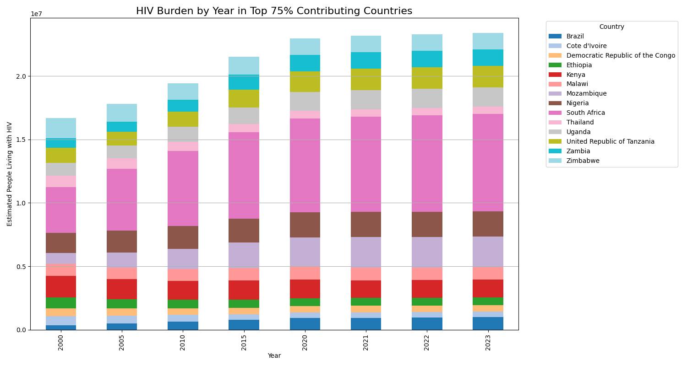
```
The overall HIV burden globally remained high from 2000 to 2023 — no sharp drop is visible.

Certain countries like South Africa, Nigeria, and Mozambique appear to contribute very large portions to the global burden every year (these countries have thicker bands in the stack).

The number of people living with HIV slightly increases between 2000 and around 2015–2020, and then appears to stabilize or slightly decrease.

The HIV epidemic remains highly concentrated in a small number of countries — that's why top contributors are enough to represent 75% of the global burden.


Generate a visualization that displays the trend of HIV cases in the countries contributing to 75% of the burden within each WHO region (column called ParentLocationCode contains the WHO regions) 

```{python}
# Calculate total HIV per country within each region
region_country_totals = hiv_data.groupby(['ParentLocationCode', 'Country'])['HIV_Population'].sum().reset_index()

# Identify top 75% contributing countries per region
top_75_countries_by_region = {}

for region in region_country_totals['ParentLocationCode'].unique():
    region_df = region_country_totals[region_country_totals['ParentLocationCode'] == region].sort_values(by='HIV_Population', ascending=False)
    total = region_df['HIV_Population'].sum()
    region_df['CumulativePercent'] = 100 * region_df['HIV_Population'].cumsum() / total
    top_countries = region_df[region_df['CumulativePercent'] <= 75]['Country'].tolist()
    top_75_countries_by_region[region] = top_countries

# Filter original hiv_data for only top 75% countries in each region
filtered_data = hiv_data[
    hiv_data.apply(lambda row: row['Country'] in top_75_countries_by_region.get(row['ParentLocationCode'], []), axis=1)
]

# Filter original hiv_data for only top 75% countries in AFR
filtered_data_afr = filtered_data[filtered_data['ParentLocationCode'] == 'AFR']

# Plot only AFR region
fig, ax = plt.subplots(figsize=(15, 6))  # Only 1 region, so 1 plot

pivot_df = filtered_data_afr.pivot_table(
    index='Year',
    columns='Country',
    values='HIV_Population',
    aggfunc='sum'
).fillna(0)

pivot_df.plot(
    kind='bar',
    stacked=True,
    colormap='tab20',
    ax=ax
)

ax.set_title('HIV Trend in AFR Region (Top 75% Countries)', fontsize=14)
ax.set_ylabel('HIV Population')
ax.legend(title='Country', bbox_to_anchor=(1.01, 1), loc='upper left')
ax.grid(axis='y')
plt.xlabel('Year')
plt.tight_layout()
plt.savefig("media/region_trends.png")
plt.close()
```
```{r}
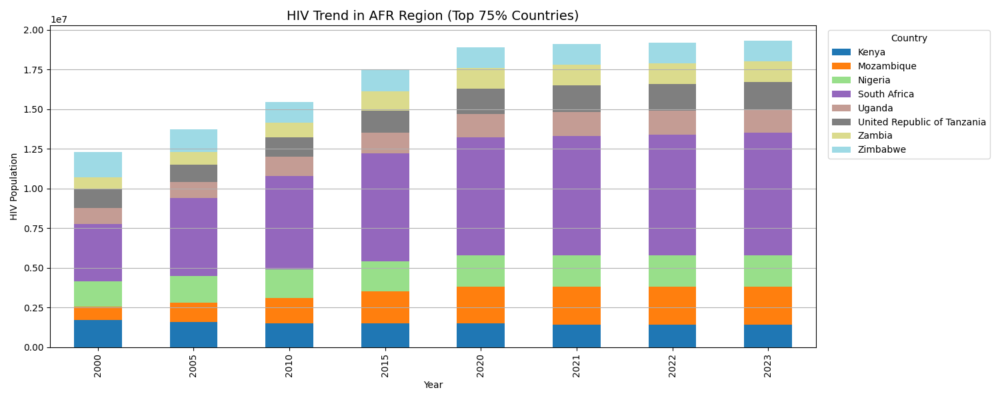
```
South Africa, Nigeria, Uganda, Kenya, and Zimbabwe dominate the HIV burden.

The HIV burden shows a gradual increase up to around 2015–2020, after which it levels off or shows early signs of decline.

Just like globally, a few countries in Africa carry a disproportionate share of the HIV burden.

The pattern highlights regional inequality: even within Africa, a small subset of countries carry the majority of cases.


## Combining hiv_data and poverty_data

We would like you to merge this dataset with the HIV data above and analyze the relationship between people living with HIV and multidimensional poverty, and the individual factors that contribute to the ratio. Remember to account for the random effects (country, year).

```{python}
# Get all possible pairs within same country
df = pd.merge(hiv_data, poverty_data, on='Country', how='inner', suffixes=('_hiv', '_poverty'))

# Calculate year difference
df['YearDiff'] = (df['Year_hiv'] - df['Year_poverty']).abs()

# Keep the row with the smallest year difference per HIV data row
df = df.loc[df.groupby(['Country', 'Year_hiv'])['YearDiff'].idxmin()].copy()

# Rename to keep consistent
df = df.rename(columns={'Year_hiv': 'Year'})
df
```

# 6. Modelling

```{python}
# Log-transform the target variable
df['log_HIV_Population'] = np.log1p(df['HIV_Population'])

# Select predictors
predictors = [
    'Monetary', 'Education_Attainment', 'Education_Enrollment',
    'Electricity', 'Sanitation', 'Drinking_Water', 'Multidimensional_Poverty'
]

# Fixed effects
X = sm.add_constant(df[predictors])

# Mixed effects model — random intercept by country
model = MixedLM(
    endog=df['log_HIV_Population'],
    exog=X,
    groups=df['Country']
)

result = model.fit()

print(result.summary())
```

## Interpretation

Multidimensional Poverty is significantly associated with higher HIV population (positive coefficient, p=0.014).

Education Enrollment and Electricity access are negatively associated — higher access → fewer HIV cases.

Other factors (Monetary, Sanitation, etc.) may not be statistically significant.

So, multidimensional poverty and education/electricity access are the most influential.

## Write a paragraph on your findings.

The mixed-effects model reveals significant insights into the relationship between multidimensional poverty and HIV prevalence across countries. Notably, Multidimensional Poverty is positively and significantly associated with the number of people living with HIV (p = 0.014), suggesting that as poverty increases—considering factors like education, healthcare access, and living conditions—so does HIV prevalence. Among the individual poverty indicators, Education Enrollment and Access to Electricity are both negatively and significantly associated with HIV (p = 0.005 and p = 0.031, respectively), indicating that higher school enrollment rates and improved electricity access may play protective roles against HIV spread. Other variables, such as sanitation, drinking water, and monetary poverty, did not show significant effects, which could imply that HIV outcomes are more strongly influenced by systemic and structural dimensions of poverty rather than income alone. Additionally, substantial between-country variability (Group Var = 3.04) highlights the importance of accounting for national contexts when addressing HIV, as some countries exhibit much higher or lower prevalence than expected, even after controlling for these poverty-related factors.

---
title: 'Task 2: Mapping Child Mortality Trends Across the East African Community'
jupyter: myenv
---


<div style="text-align: center;">
    
</div>

# 1. Business Understanding

## 1.1 Problem Statement

Child mortality remains a major public health concern in the East African Community (EAC), where disparities in healthcare access and socioeconomic factors contribute to varying outcomes across countries. This analysis aims to explore spatial and temporal patterns of under-five and neonatal mortality rates within the EAC region. By leveraging geospatial data and time-series visualizations, the project seeks to identify countries with the highest burden of child mortality and uncover regional trends, supporting evidence-based interventions and policymaking.

## 1.2 Objectives

1. Filter data for the eight countries belonging to the East African Community (list here: https://www.eac.int/overview-of-eac)
2. Visualize the latest estimate of each indicator at the country level using shapefiles, which can be downloaded from www.gadm.org.
3. Show the average trends in the mortality rates over time (plot the average trend line and add the points in the graphic for the country level estimates for each indicator. Expectation: two plots).
4. Based on your visualizations, identify the countries with the highest under-five mortality rates in East Africa and the highest neonatal mortality.

# 2. Importing Libraries and Warnings

```{r setup, include=FALSE}
library(reticulate)
use_condaenv("r_env", required = TRUE)
```

```{r}
reticulate::py_install(
  packages = c("pandas", "seaborn", "geopandas", "matplotlib"),
  envname = NULL, # NULL means "use the current one"
  method = "auto",
  pip = TRUE
)
```


```{python}
import json
import warnings
import pandas as pd
import seaborn as sns
import geopandas as gpd
import matplotlib.pyplot as plt
warnings.filterwarnings("ignore")
```

# 3. Data Understanding


```{python}
# loading the data
burundi = gpd.read_file("data/gadm41_BDI_0.json")

# View and inspect
print(burundi.head())
print(burundi.crs) 

# Plot and save
ax = burundi.plot(figsize=(8, 6))
fig = ax.get_figure()
fig.savefig("media/burundi_map.png", dpi=300)
```
```{r}
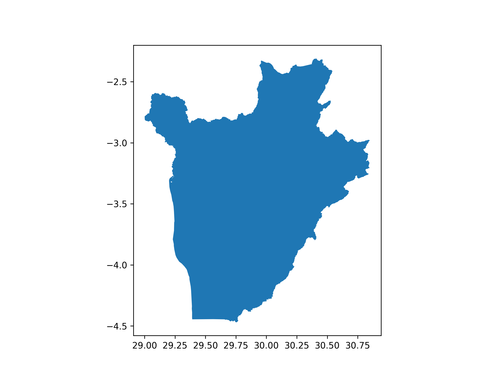
```

```{python}
# loading the data
congo = gpd.read_file("data/gadm41_COD_0.json")

# View and inspect
print(congo.head())
print(congo.crs) 

# Plot and save
ax = congo.plot(figsize=(8, 6))
fig = ax.get_figure()
fig.savefig("media/congo_map.png", dpi=300)
```

```{r}
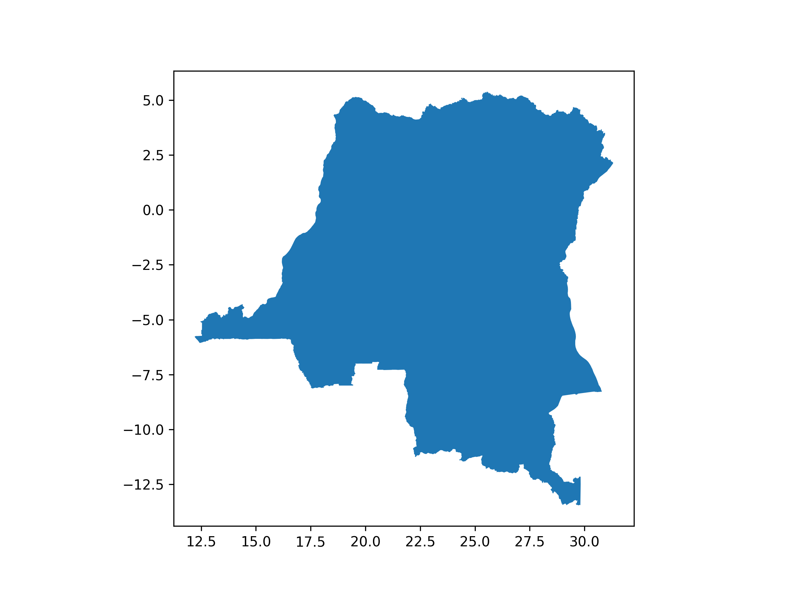
```

```{python}
# loading the data
kenya = gpd.read_file("data/gadm41_KEN_0.json")

# View and inspect
print(kenya.head())
print(kenya.crs) 

# Plot and save
ax = kenya.plot(figsize=(8, 6))
fig = ax.get_figure()
fig.savefig("media/kenya_map.png", dpi=300)
```

```{r}
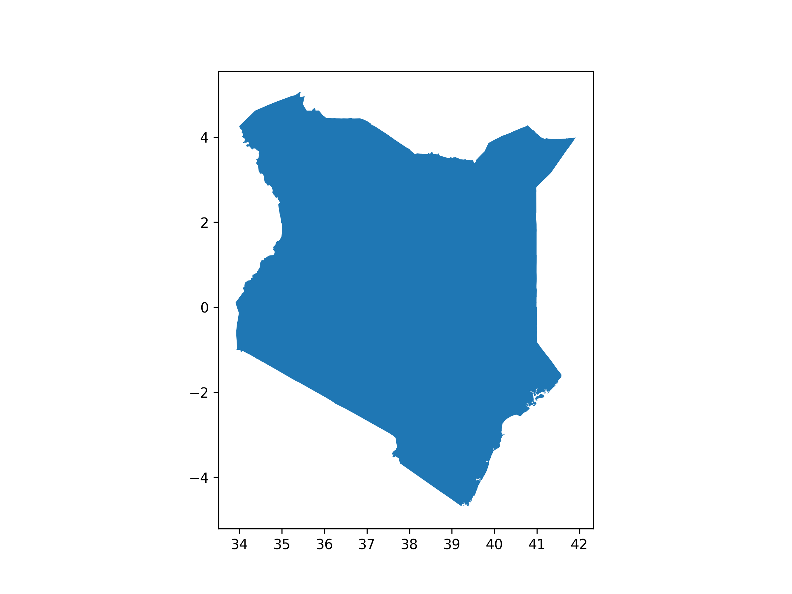
```

```{python}
# loading the data
rwanda = gpd.read_file("data/gadm41_RWA_0.json")

# View and inspect
print(rwanda.head())
print(rwanda.crs) 

# Plot and save
ax = rwanda.plot(figsize=(8, 6))
fig = ax.get_figure()
fig.savefig("media/rwanda_map.png", dpi=300)
```

```{r}
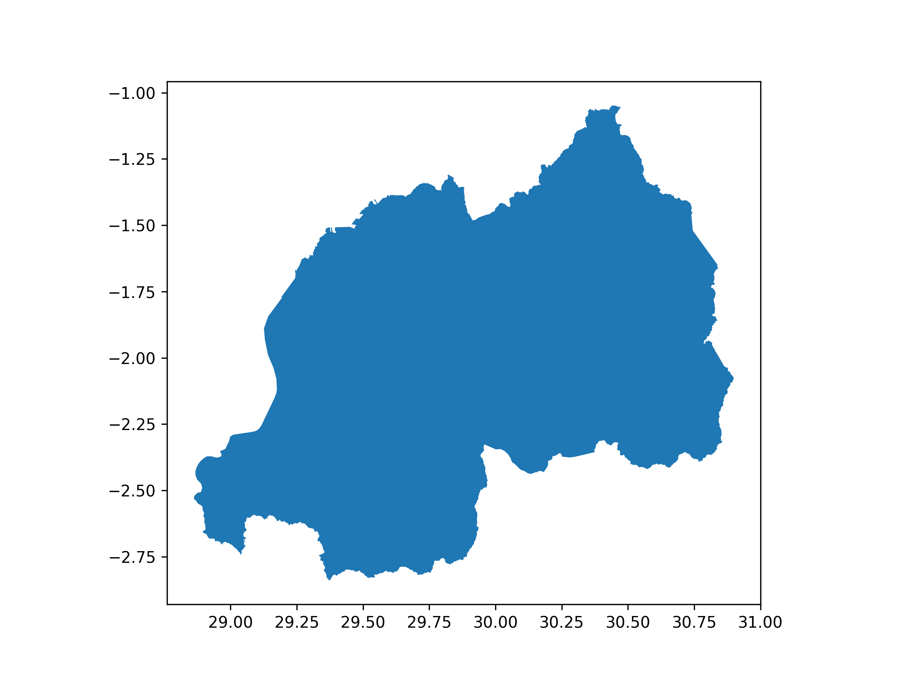
```

```{python}
# loading the data
somalia = gpd.read_file("data/gadm41_SOM_0.json")

# View and inspect
print(somalia.head())
print(somalia.crs) 

# Plot and save
ax = somalia.plot(figsize=(8, 6))
fig = ax.get_figure()
fig.savefig("media/somalia_map.png", dpi=300)
```

```{r}
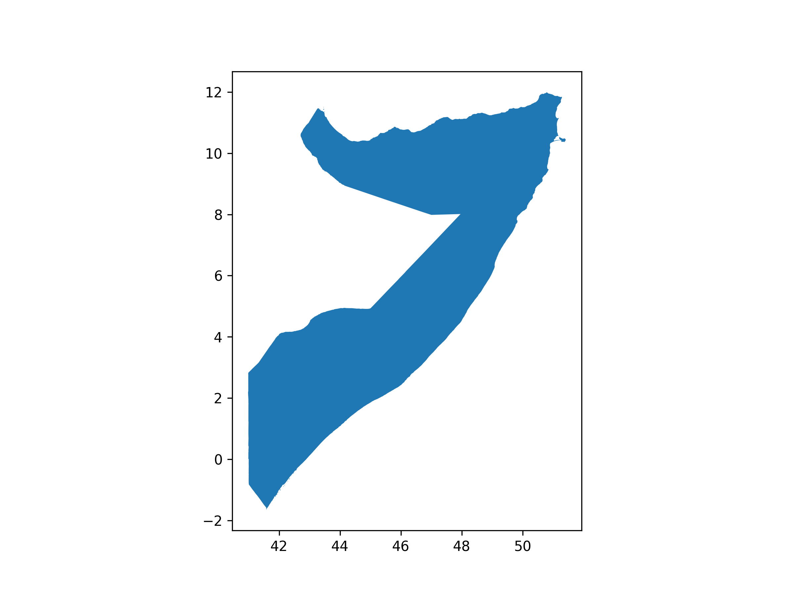
```

```{python}
# loading the data
sudan = gpd.read_file("data/gadm41_SSD_0.json")

# View and inspect
print(sudan.head())
print(sudan.crs) 

# Plot and save
ax = sudan.plot(figsize=(8, 6))
fig = ax.get_figure()
fig.savefig("media/sudan_map.png", dpi=300)
```

```{r}
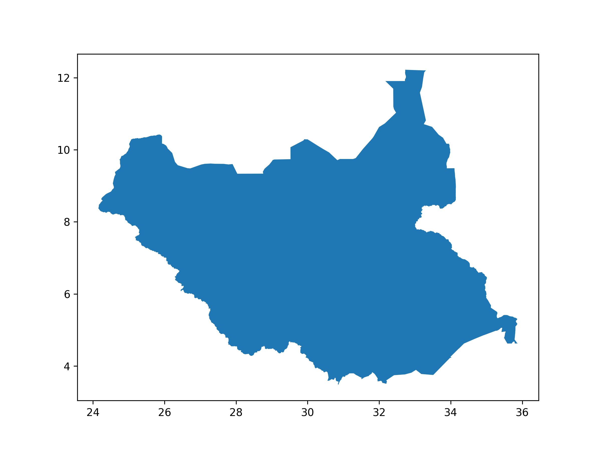
```

```{python}
# loading the data
tanzania = gpd.read_file("data/gadm41_TZA_0.json")

# View and inspect
print(tanzania.head())
print(tanzania.crs) 

# Plot and save
ax = tanzania.plot(figsize=(8, 6))
fig = ax.get_figure()
fig.savefig("media/tanzania_map.png", dpi=300)
```

```{r}
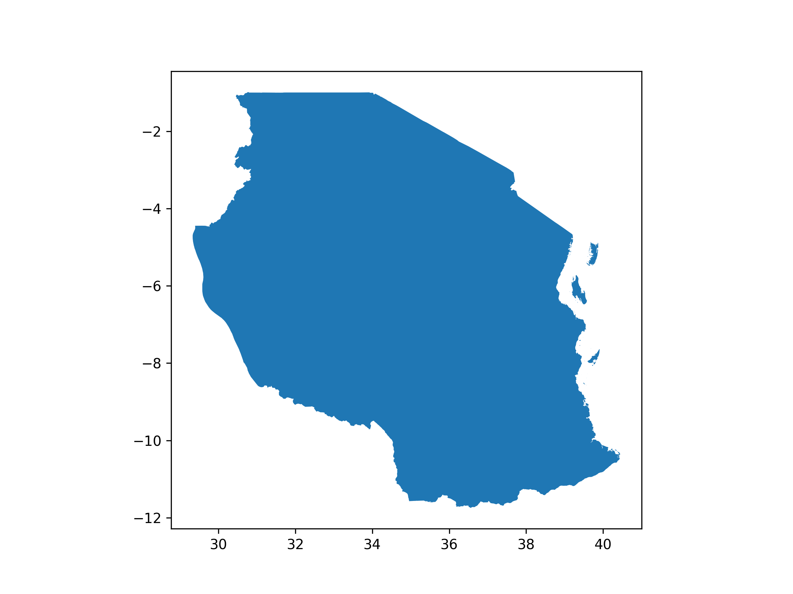
```

```{python}
# loading the data
uganda = gpd.read_file("data/gadm41_UGA_0.json")

# View and inspect
print(uganda.head())
print(uganda.crs) 

# Plot and save
ax = uganda.plot(figsize=(8, 6))
fig = ax.get_figure()
fig.savefig("media/uganda_map.png", dpi=300)
```

```{r}
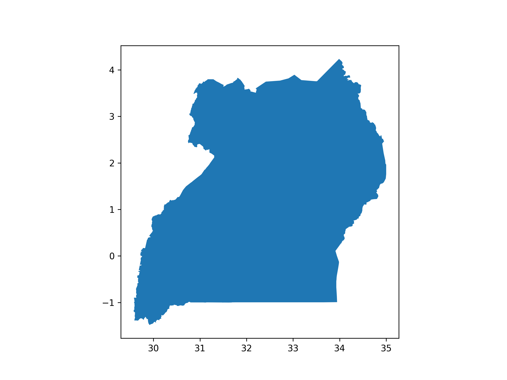
```

## Merging the 8 countries into a dataframe called east_africa

```{python}
# Merge them
east_africa = gpd.GeoDataFrame(pd.concat([
    burundi, congo, kenya, rwanda, somalia, sudan, tanzania, uganda
], ignore_index=True))

# displaying the result
print(east_africa.head())
print(east_africa.crs) 
print(east_africa.plot())

# Plot and save
ax = east_africa.plot(figsize=(8, 6))
fig = ax.get_figure()
fig.savefig("media/east_africa_map.png", dpi=300)
```
```{r}
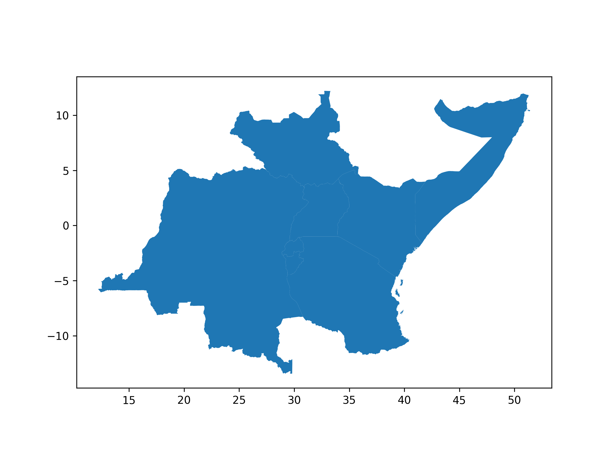
```


```{python}
east_africa.columns
```

```{python}
under_five = pd.read_excel("data/Under-five_Mortality_Rates_2024.xlsx", skiprows=14)
under_five
```

```{python}
under_five.columns
```

```{python}
under_five.describe()
```

```{python}
neonatal = pd.read_excel("data/Neonatal_Mortality_Rates_2024.xlsx", skiprows=14)
neonatal.head()
```

```{python}
neonatal.columns
```

```{python}
neonatal.describe()
```

# 4. Data Cleaning

## Dropping unwanted columns

```{python}
# Filter for median values only
under_five = under_five[
    (under_five['Uncertainty.Bounds*'] == 'Median')
][['ISO.Code', 'Country.Name', 'Uncertainty.Bounds*', '2010.5', '2011.5', '2012.5', '2013.5', '2014.5', '2015.5', '2016.5', '2017.5', '2018.5', '2019.5', '2020.5', '2021.5', '2022.5', '2023.5']]

under_five
```

```{python}
neonatal = neonatal[
    (neonatal['Uncertainty.Bounds*'] == 'Median')
][['ISO.Code', 'Country.Name', 'Uncertainty.Bounds*', '2010.5', '2011.5', '2012.5', '2013.5', '2014.5', '2015.5', '2016.5', '2017.5', '2018.5', '2019.5', '2020.5', '2021.5', '2022.5', '2023.5']]

neonatal
```

## Renaming columns

```{python}
east_africa = east_africa.rename(columns={
    'GID_0': 'code',
    'COUNTRY': 'country',
})

east_africa
```

```{python}
under_five = under_five.rename(columns={
    'ISO.Code': 'code',
    'Country.Name': 'country',
    'Uncertainty.Bounds*': 'estimate_type',
    '2010.5': '2010',
    '2011.5': '2011',
    '2012.5': '2012',
    '2013.5': '2013',
    '2014.5': '2014',
    '2015.5': '2015',
    '2016.5': '2016',
    '2017.5': '2017',
    '2018.5': '2018',
    '2019.5': '2019',
    '2020.5': '2020',
    '2021.5': '2021',
    '2022.5': '2022',
    '2023.5': '2023'
})

under_five
```

```{python}
neonatal = neonatal.rename(columns={
    'ISO.Code': 'code',
    'Country.Name': 'country',
    'Uncertainty.Bounds*': 'estimate_type',
        '2010.5': '2010',
    '2011.5': '2011',
    '2012.5': '2012',
    '2013.5': '2013',
    '2014.5': '2014',
    '2015.5': '2015',
    '2016.5': '2016',
    '2017.5': '2017',
    '2018.5': '2018',
    '2019.5': '2019',
    '2020.5': '2020',
    '2021.5': '2021',
    '2022.5': '2022',
    '2023.5': '2023'
})

neonatal
```

## Duplicates

```{python}
east_africa.duplicated().sum()
```

```{python}
under_five.duplicated().sum()
```

```{python}
neonatal.duplicated().sum()
```

## Missing Values

```{python}
east_africa.isna().sum()
```

```{python}
under_five.isna().sum()
```

```{python}
neonatal.isna().sum()
```

```{python}
# List of East African countries codes
eac_codes = ['BDI', 'COD', 'KEN', 'RWA', 'SOM', 'SSD', 'TZA', 'UGA']

# Filter under_five
under_five_eac = under_five[under_five['code'].isin(eac_codes)]
under_five_eac
```

```{python}
# Filter neonatal
neonatal_eac = neonatal[neonatal['code'].isin(eac_codes)]
neonatal_eac
```

```{python}
# Merge under-five mortality rates into east_africa shapefile
east_africa_under_five = east_africa.merge(under_five_eac, on='code')
east_africa_under_five
```

```{python}
# drop extra columns
east_africa_under_five.drop(columns = ['country_y'], axis = 1, inplace = True)

# rename country_x to country
east_africa_under_five.rename(columns={
    'country_x': 'country'
}, inplace = True)

east_africa_under_five
```

```{python}
# Merge neonatal mortality rates into east_africa shapefile
east_africa_neonatal = east_africa.merge(neonatal_eac, on='code')
east_africa_neonatal
```

```{python}
# drop extra columns
east_africa_neonatal.drop(columns = ['country_y'], axis = 1, inplace = True)

# rename country_x to country
east_africa_neonatal.rename(columns={
    'country_x': 'country'
}, inplace = True)

east_africa_neonatal
```

# 5. EDA

## Visualize the latest estimate of each indicator at the country level using shapefiles

```{python}
# Plot under-five mortality and save to a file
fig, ax = plt.subplots(1, 1, figsize=(10, 8))
east_africa_under_five.plot(column='2023', cmap='Reds', legend=True, ax=ax)
ax.set_title('Under-Five Mortality Rate in East Africa (2023)', fontsize=15)
plt.axis('off')

# Save the figure
plt.savefig('media/under_five_mortality_2023.png', dpi=300, bbox_inches='tight')
```
```{r}
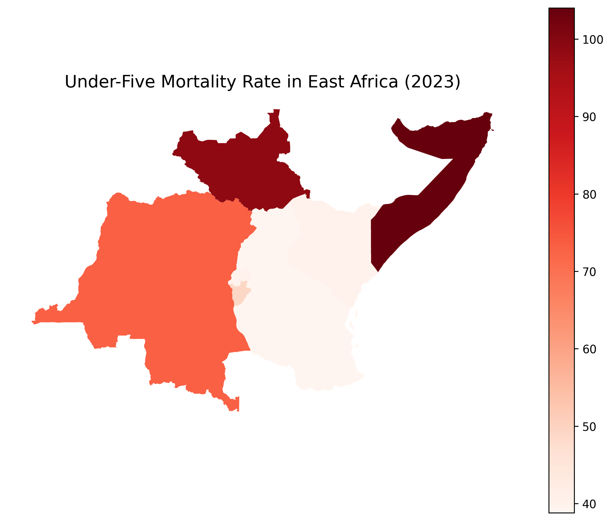
```

### Interpretation

South Sudan and Somalia consistently have the highest under-five mortality rates (above 100 deaths per 1000 live births for much of the period).

Kenya, Rwanda, Tanzania, and Uganda show much lower rates — below 70 deaths/1000 births, and they keep decreasing over time.

The average mortality rate across East Africa shows a steady decline over the years.

Some countries (like Somalia and South Sudan) have a lot more fluctuations, while others (like Rwanda and Kenya) show a smoother decline.

```{python}
# Plot neonatal mortality
fig, ax = plt.subplots(1, 1, figsize=(10, 8))
east_africa_neonatal.plot(column='2023', cmap='Blues', legend=True, ax=ax)
ax.set_title('Neonatal Mortality Rate in East Africa (2023)', fontsize=15)
plt.axis('off')

# Save the figure
plt.savefig('media/neonatal_mortality_2023.png', dpi=300, bbox_inches='tight')
```
```{r}
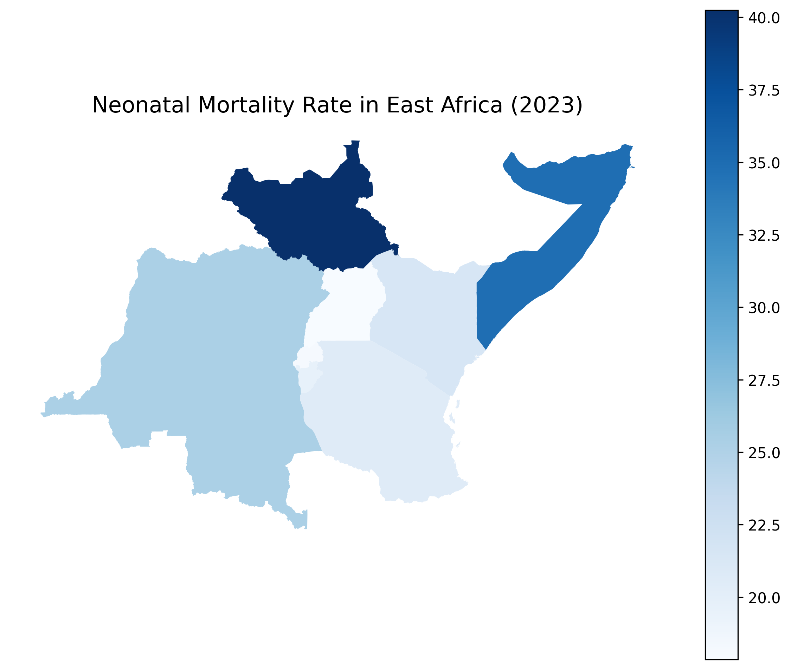
```

### Interpretation

The rates are lower than under-five mortality overall (as expected), but similar country patterns.

South Sudan and Somalia again show the highest neonatal mortality rates (around 40–45 deaths per 1000 births).

Kenya, Rwanda, and Tanzania again have much better outcomes (around 20–25 deaths per 1000).

The average neonatal mortality across the region is steadily declining, although the decline is slower compared to the under-five mortality rate.

## Show the average trends in the mortality rates over time (plot the average trend line and add the points in the graphic for the country level estimates for each indicator. Expectation: two plots). 

```{python}
# reshape the data
under_five_melted = east_africa_under_five.melt(
    id_vars=['code', 'country'], 
    value_vars=[str(year) for year in range(2010, 2024)],
    var_name='year', 
    value_name='under_five_rate'
)

# Convert year to integer
under_five_melted['year'] = under_five_melted['year'].astype(int)

plt.figure(figsize=(14,6))

sns.lineplot(
    data=under_five_melted,
    x='year',
    y='under_five_rate',
    ci=None,
    label='Average',
    estimator='mean'
)

sns.scatterplot(
    data=under_five_melted,
    x='year',
    y='under_five_rate',
    hue='country',
    s=40
)

plt.title('Under-Five Mortality Rate (East Africa)')
plt.ylabel('Mortality Rate (per 1000 live births)')
plt.xlabel('Year')
plt.legend(title='Country', bbox_to_anchor=(1.05, 1), loc='upper left')
plt.tight_layout()

# Save as file
plt.savefig('media/under_five_mortality_rate_east_africa.png', dpi=300, bbox_inches='tight')
```
```{r}
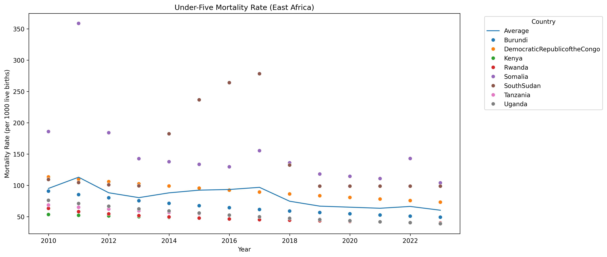
```

### Interpretation

South Sudan and Somalia are deep red, meaning very high under-five mortality (>100 deaths/1000).

Kenya, Tanzania, and Rwanda are much lighter, indicating lower under-five mortality (closer to 40-50 deaths/1000).

```{python}
# reshape the data
neonatal_melted = east_africa_neonatal.melt(id_vars=['code', 'country'], 
                                   value_vars=[str(year) for year in range(2010, 2024)],
                                   var_name='year', 
                                   value_name='neonatal_rate')

# Convert year to integer
neonatal_melted['year'] = neonatal_melted['year'].astype(int)

# Plotting
plt.figure(figsize=(14,6))

# Neonatal mortality plot
plt.subplot(1, 2, 2)
sns.lineplot(
    data=neonatal_melted,
    x='year',
    y='neonatal_rate',
    ci=None,
    label='Average',
    estimator='mean'
)
sns.scatterplot(
    data=neonatal_melted,
    x='year',
    y='neonatal_rate',
    hue='country',
    s=40
)
plt.title('Neonatal Mortality Rate (East Africa)')
plt.ylabel('Mortality Rate (per 1000 live births)')
plt.xlabel('Year')
plt.legend(title='Country', bbox_to_anchor=(1.05, 1), loc='upper left')
plt.tight_layout()

# Save the plot as a PNG image
plt.savefig('media/neonatal_mortality_rate_east_africa.png', dpi=300, bbox_inches='tight')
```
```{r}
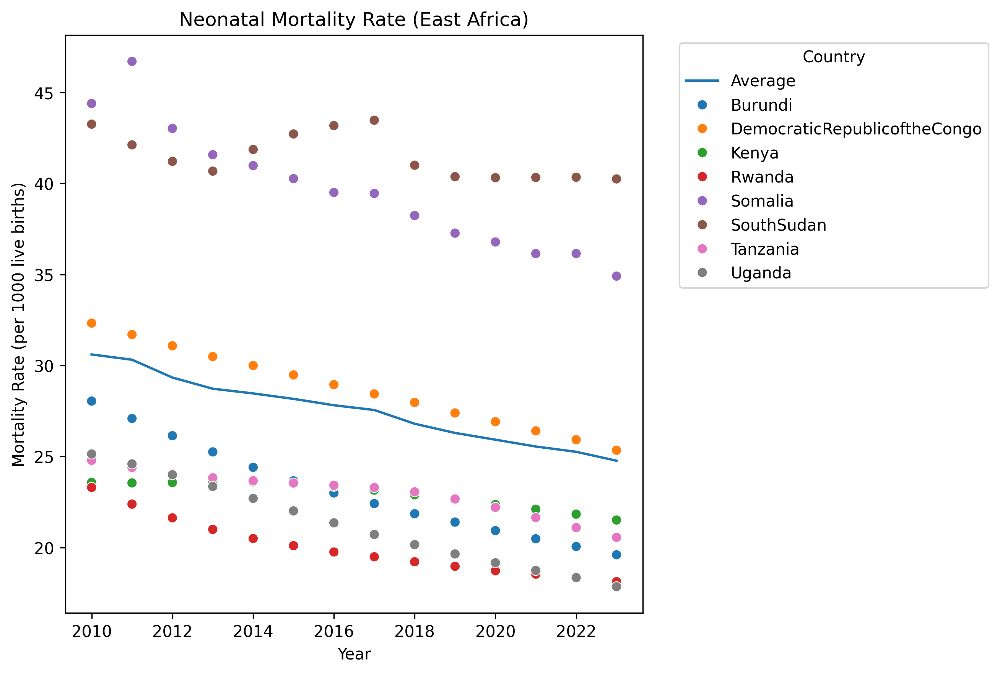
```
### Interpretation

Again, South Sudan and Somalia are the darkest, meaning they have the highest neonatal deaths (>37 deaths/1000).

Kenya, Rwanda, and Tanzania show the lowest neonatal mortality, shaded much lighter.

Most other countries fall somewhere in between.

## Based on your visualizations, identify the countries with the highest under-five mortality rates in East Africa and the highest neonatal mortality. 

```{python}
# Highest under-five mortality
highest_under_five = under_five_eac.sort_values(by='2023', ascending=False).head(1)

# Highest neonatal mortality
highest_neonatal = neonatal_eac.sort_values(by='2023', ascending=False).head(1)

print("Highest Under-Five Mortality:", highest_under_five[['country', '2023']])
print("Highest Neonatal Mortality:", highest_neonatal[['country', '2023']])
```

### Interpretation

In 2023, Somalia recorded the highest under-five mortality rate in East Africa, with approximately 104 deaths per 1,000 live births, indicating a severe challenge in child survival beyond the neonatal stage. Meanwhile, South Sudan had the highest neonatal mortality rate, with about 40 deaths per 1,000 live births, reflecting major issues in newborn health and care within the first month of life. These figures suggest that both countries are facing critical health system weaknesses, likely exacerbated by ongoing conflict, instability, and limited access to quality maternal and child healthcare services.

## Write a paragraph on your findings.

Between 2010 and 2023, East Africa experienced a steady decline in both under-five and neonatal mortality rates, reflecting significant improvements in child health outcomes across the region. Countries like Rwanda, Kenya, Tanzania, and Uganda achieved the most notable progress, consistently recording lower mortality rates compared to regional averages. In contrast, South Sudan and Somalia continued to report the highest rates, with under-five mortality often exceeding 100 deaths per 1,000 live births and neonatal mortality remaining above 40 deaths per 1,000 live births. The regional averages show a positive downward trend, although the pace of improvement varied across countries. By 2023, the spatial distribution maps clearly highlighted persistent disparities, with countries experiencing political instability and conflict showing the greatest challenges in reducing child mortality, while more stable nations demonstrated remarkable success in improving early childhood survival.

